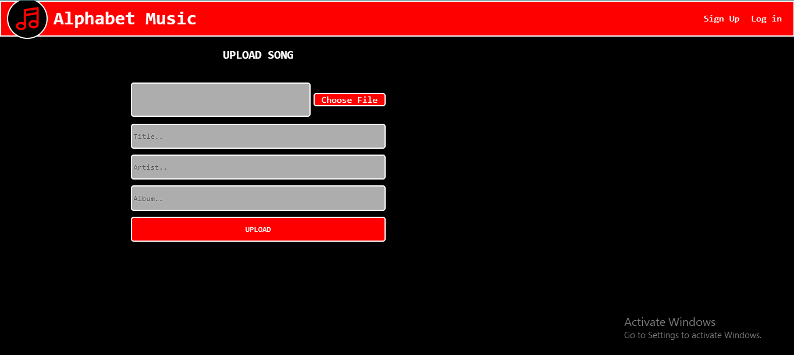

# Alphabet Music API [Link](https://good-tan-beaver-hat.cyclic.app)

The Alphabet Music API offers a comprehensive set of features for managing and exploring music content. It empowers users to upload songs, search for music, and interact with artists seamlessly.

## Installation

1. Clone the repository to your local machine:
- git clone https://github.com/KKBhati07/Alphabet-Music-API.git

2. Move to the project directory

3. On your Command Prompt/powershell, run this command to install all your dependencies
- npm install

4. Configure the database:
- Update the MongoDB connection in config/mongoose.js if necessary.

5. start the server:
- node index.js 

## Usage

To use the Alphabet Music API, you can make HTTP requests to the provided endpoints using tool like `Postman`, or integrate it into your front-end application.

## API Endpoints

- `POST /api/v1/users/create`: Create a new user account.
- `POST /api/v1/users/create-session`: Log in and create a session with a user account.
- `PATCH /api/v1/users/update/:id`: Update user's details (authentication required) .
- `PATCH /api/v1/users/update`: Update user details (authentication required) .
- `DELETE /api/v1/users/destroy`: Delete a user account (authentication required).

- `POST /api/v1/songs/upload`: Upload a music file along with metadata (title, artist, album) to the server.
- `GET /api/v1/songs/fetch`: Fetch a list of all songs from the server.
- `GET /api/v1/songs/search`: Search for songs by title.
- `DELETE /api/v1/songs/destroy/:id`: Delete a song from the server.

- `GET /api/v1/artists/:id/songs`: Fetch songs by a specific artist.
- `GET /api/v1/artists/fetch`: Retrieve a list of all artists.
- `GET /api/v1/artists/search`: Search for artists by name.

- `GET /api/v1/albums/:id/songs`: Fetch songs by a specific albums.
- `GET /api/v1/albums/fetch`: Retrieve a list of all albums.
- `GET /api/v1/albums/search`: Search for albums by name.

## Swagger Documentation

- Explore the API using the Swagger documentation.
- After starting the server, navigate to `http://localhost:3300/api-docs` in your web browser to access the Swagger UI interface.
- It provides a user-friendly way to understand and test the API endpoints.

## Authentication

It uses JSON Web Tokens (JWT) for user authentication. To access protected endpoints, include the JWT token in the `Authorization` header of the request.

## Screenshots

